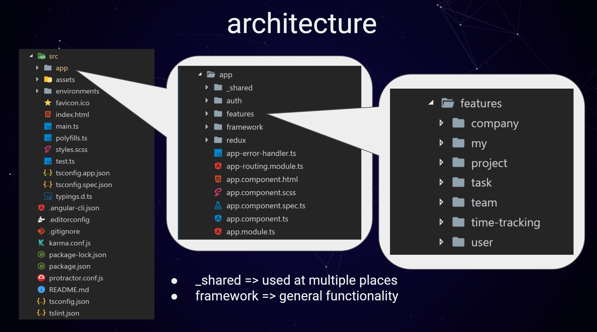
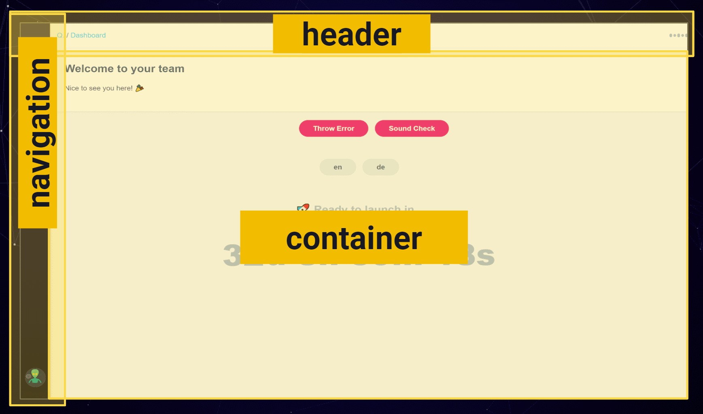
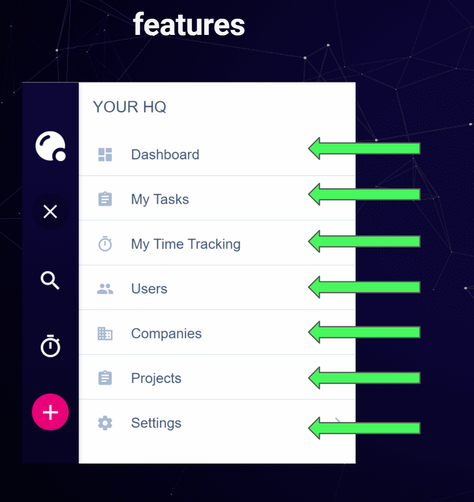
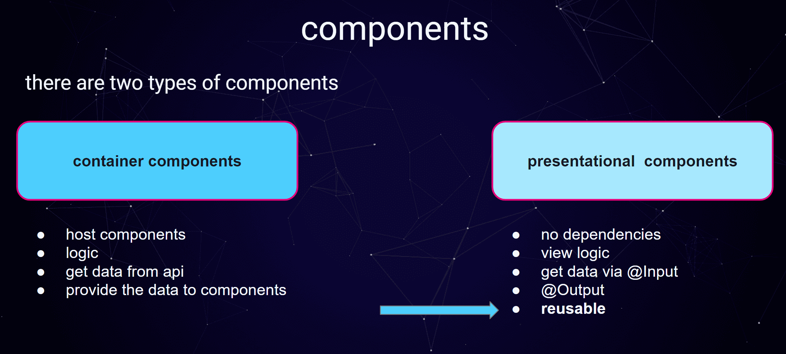
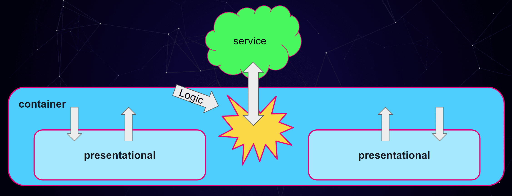
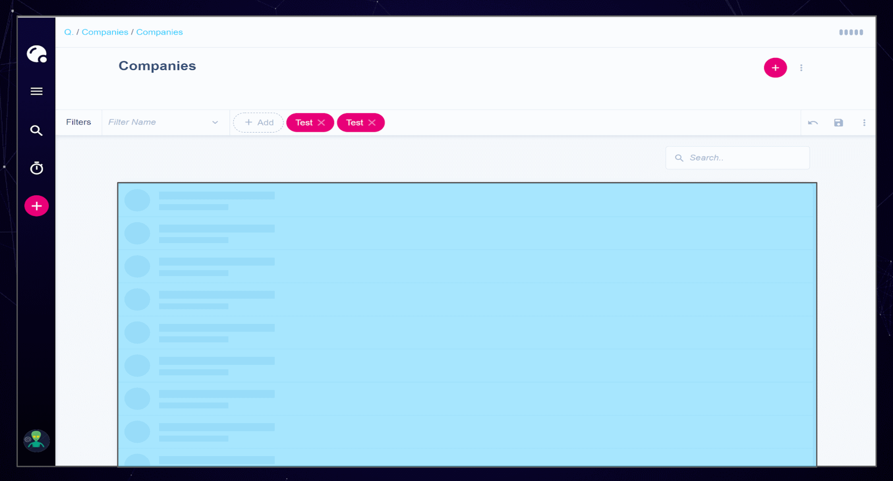
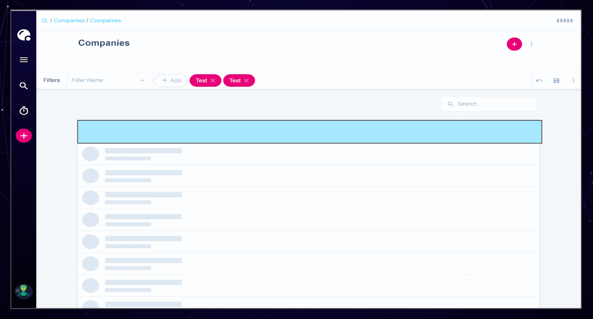
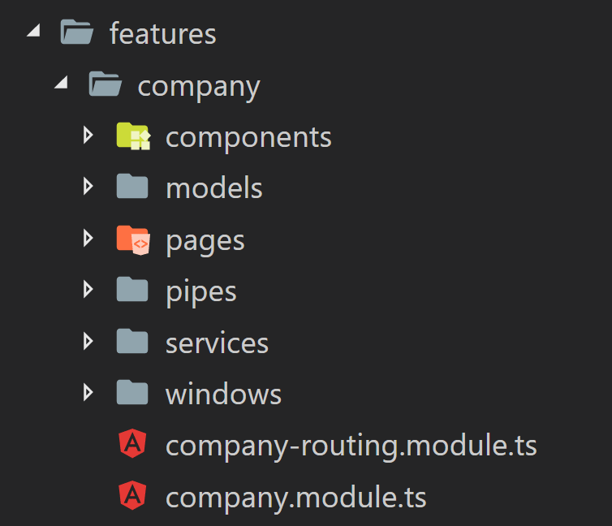

> 原文：<https://webdave.de/blog/Dont_get_lost_in_structure>
>
> 作者：[David Müllerchen](/authors/web-deve)
>

# Don't get lost in structure

# 不要为项目结构发愁

Most of us started developing Angular apps with one of these many tutorials out in the internet.

我们大多数人都是从网上的某个教程学习开发 Angular 应用的。

All the authors - which I belong to as well - have done a great job showing the basics and these "how-to-get-started"-articles. But these are very small example projects that are far away from a real world app. The real challenge comes mostly if the code grows starting with a certain size of the codebase.

所有的作者（也包括我）都做了很出色的工作，展示了这些基础知识和“如何开始”的文章。但是，这些都是非常小的示例项目，它们离现实世界中的应用还很远。真正的挑战是从代码库增长到一个特定的大小时才开始的。

Luckily I had the possibility to participate in several large Angular applications until now. And I realized that all teams are facing the same problems at the beginning of their project:

幸运的是，到目前为止，我有幸参与了几个大型的 Angular 应用。我意识到所有的团队在项目开始时都遇到了同样的问题：

> Btw these are the questions that I usually hear in my workshops.
>
> 顺便说一下，这些也是我在研讨会上经常听到的问题。
>

In this blogpost I'll try to skim on some examples of what I have come up with as good solutions for myself.

在这篇博客文章中，我将概略分享下我的一些例子，它们都是相当漂亮的解决方案。

> Please keep in mind: these are my solutions. If you disagree let's discuss this here or on twitter @webdave_de.
>
> 请记住：这些都是我的解决方案。如果你有别的想法，欢迎在这里或 twitter 上讨论 @webdave_de。
>

Here are the questions and problems:

下面是问题和疑问：

1. Which folder structure should I build to stay scalable?

   我应该构建什么样的文件夹结构以保持可伸缩性？

1. How do I cut modules?

   我该如何切分模块？

1. Is it possible to have too much modules?

   这样做会导致拥有太多模块吗？

1. Which components are there?

   都有哪些组件？

1. What belongs in a component, what in a service?

   什么该放入组件中，什么该放入服务中？

1. Where should I provide services?

   我该在哪里提供服务？

1. The imports are too long!

   导入表太长了！

1. How to keep my code maintainable even for colleagues?

   如何让我的代码容易被同事们维护？

#### Folder structure

#### 文件夹结构

Since Angular CLI stepped in most of the Angular projects are scaffold with it. Hence we often have a well known poject structure.

自从 Angular CLI 推出之后，大多数 Angular 项目都是用它搭建的。因此，我们经常会有一个众所周知的项目结构。

In the project root folder we see some files and three folders: "e2e", "node_modules" and "src"
We want to focus on the `src` folder for now. Here our application code is located.
Inside the "src" folder we'll see the `app` folder where our application logic is located.

在项目的根文件夹中，我们看到了一些文件和三个文件夹：`e2e`、`node_modules` 和 `src`。我们现在集中讨论 `src` 文件夹，这里是我们的应用代码。在 `src` 文件夹中，我们会看到应用逻辑所在的 `app` 文件夹。

So we have a nice starting point. Kudos to the CLI team btw.!

所以我们有一个很好的起点。为 CLI 团队点赞。

But that's not enough: The next step should be the structure of our application in the `app` folder.

但这还不够：下一步要看的是 `app` 文件夹中应用的结构。

In there we can split the application in some sub folders to organize our code better. It’s very common to do it like that.

在那里，我们可以把应用分成一些子文件夹来更好地组织我们的代码。这种做法很常见。

First of all we want to create a `feature` folder for our features we want to implement in our app.
We also want to have a `framework` folder and a `shared` folder.

首先，我们要为想在应用中实现的那些特性创建一个 `feature` 文件夹。我们还要有一个 `framework` 文件夹和一个 `shared` 文件夹。

> They seem to be very similar but if we take a look at the functionalities we can see the differences.
>
> 它们看起来非常相似，但是如果只要看一下这些功能，就会明白它们之间的差异。
>

- <strong>shared</strong>: is used at multiple places

  **shared** ：会被用在多个地方

- <strong>framework</strong>: is used generaly

  **framework** ：是通用的

That’s the outline of our architecture.

我们这个架构的大纲是这样的。



Now let's have a look at a very common user interface (UI).

接下来，让我们来看一个很常见的用户界面（UI）。

Most of the apps have a navigation, a header and something very often called "container" or "view".

大多数应用都有一个导航、一个标题，和一些名叫容器（`container`）或视图（`view`）的东西。



Those parts together are known as the <strong>app shell</strong>.
The app shell is a very important part of your app. It's visible almost everywher and an important piece of code when you start thinking about Progressive Web Applications (PWAs).

这些部分加起来被称为**应用外壳（app shell）**。应用外壳是应用中非常重要的一部分。当你开始考虑使用渐进式Web应用（PWA）时，几乎到处都能看到它，并且是代码的重要组成部分。

So where would we expect the app shell to be located?
Right: in `framework` folder because it's a generaly used functionality.

那么，我们应该把应用外壳放到什么位置？说对了！就放到 `framework` 文件夹中，因为它是一种通用的功能。

#### Cut your code into modules

#### 把代码切分成模块

Next let's talk about the `features`.
To get the idea of the features of an app it's always a good strategy to look at the menu/navigation.

接下来让我们谈谈这些 `features`。要了解应用的这些特性，看菜单/导航是一个很好的方式。



All this entries are features.

这些条目都是特性模块。

> very important principle:
>
> 很重要的原则：
>

- split your application into features.

  把你的应用拆分成多个特性。

- every feature should have it’s own module.

  每个特性都应该拥有它自己的模块。

  that’s called <strong> single responsibility principle (SRP)</strong>

  这也被成为**单一职责原则（SRP）**

in fact that means:

事实上，这意味着：

- <h3>no amme <small>(a module managing everything)</small></h3>

  <h3>不要用一个模块管理一切。no amme <small>(a module managing everything)</small></h3>

- <h3>no asme <small>(a service managing everything)</small></h3>

  <h3>不要用一个服务管理一切。no asme <small>(a service managing everything)</small></h3>

- <h3>no acme <small>(a component managing everything)</small></h3>

  <h3>不要用一个组件管理一切。no acme <small>(a component managing everything)</small></h3>
  
- <h3>no adme <small>(a directive managing everything)</small></h3>

  <h3>不要用一个指令管理一切。no adme <small>(a directive managing everything)</small></h3>

#### FAQ

#### 常见问题

> <i>Q: But if I split everything into modules it is possible to have too many modules?</i>
>
> *问：但如果把所有内容都分成模块，会不会导致拥有太多模块？*
>

A: No! The maintainability grows by the number of modules. Split your app into modules and your modules into sub modules

A：不会！增加模块数量会增加可维护性。把你的应用拆分成模块，再把你的模块拆分成子模块。

#### Type of components

#### 组件的类型

So what about Components? Components represent the UI stuff of our app. We can break them up into two categories:

那么组件如何？组件代表了我们应用的 UI 内容。我们可以把它分为两类：

container components and presentational (or dumb) components.

容器组件和展现组件（或叫哑组件）。

1. Container Components can host other components and logic. They are connected to services to get data maybe from an api and provide this data to their child components

   容器组件可以作为其它组件和逻辑的宿主。它们与服务相连，可以从 api 中获取数据，并把这些数据提供给子组件

1. Dump Components have no dependencies, they only have logic which is directly used for their view. They get all the data they need through the @Input decorators, communicate with their parents through @Output decorators
   and they are reusable.

   哑组件没有依赖，它们只有那些直接用于其视图的逻辑。他们通过 @Input 装饰器获取所需的全部数据，并通过 @Output 装饰器与父级进行通信，并且可被复用。



Just a small explanation of the connection and the data flow here

这只是对连接和数据流的一个小小解释

We have a container component with some logic and it holds some presentational components.
All the data the presentational components need are passed through the @Input decorators. If they want to talk to their parents they would make use of an @Output decorator. If we use a service for some stuff we only use it in the container component.

我们有一个带有一些逻辑的容器组件，它拥有一些展现组件。展现组件需要的所有数据都会通过 @Input 装饰器传入。如果它们想和父组件交谈，就要利用 @Output 装饰器。如果我们要使用某个服务，就应该只在容器组件中使用它。



To identify these kind of components take a look at the mockups. Sections which can be splitted into smaller parts are container components.

为了识别出这些组件，我们来看一下这些模型。容器组件可以拆分成一些小部件。



Those small parts can be presentational components

这些小部件可以作成展现组件



#### Reuse code

#### 复用代码

Components can be reused but logic can be reused, too. We can relocate logic into services.

组件可以复用，但逻辑也可以复用。我们可以把逻辑移到服务中。

Almost all logic in am app should fit to one of the following categories:

应用中几乎所有的逻辑都属于以下类别之一：

1. View logic

   视图逻辑

1. Reusable logic (the logic we copy ‘n paste in a bunch of components)

   可复用的逻辑（此逻辑我们会复制粘贴到一堆组件中）

1. Logic to call the api and manage the data

   用来调用 api 和管理数据的逻辑

1. All the other logic ;)

   所有其它逻辑;）

> Dont mess arround with the dependency tree. Provide the logic at the top most point where it is needed. It might be a component or a module or even another service.
>
> 不要乱用依赖树。只在最需要的地方提供逻辑。它可能是一个组件或一个模块，甚至是另一个服务。
>

#### Stay maintainable

#### 保持可维护性

Maybe your structure is very deep.
And this means you have looooong imports.

也许你的结构很深。这意味着你的导入表可能很长长长长……

```javascript
import { MyService } from "../../../shared/my/logic/services/my-service/my.service";
```

That's no problem if your IDE is able to manage the imports automatically but if you move modules to another place, it can get hard to refactor and maintain. Yes it is a pain but there is a solution.

如果你的 IDE 能够自动管理这些导入，那就没问题了。但是如果你要把模块移到另一个地方，它就很难重构和维护。是的，这很痛苦，但也有解决方案。

`pathmap`.

The pathmap is an awesome typescript feature. You can define a mapping table in your tsconfig.json

路径映射（pathmap）是一个很棒的 TypeScript 特性。你可以在 `tsconfig.json` 中定义一个映射表

## tsconfig.json

```javascript
 "compilerOptions": {
   ...
   "baseUrl": "src",
   "paths": {
     "@my-logic/*": ["app/shared/my/logic/services*"],
   }
 },
```

which can maybe change your developer live

这可能会给你的开发生活带来改变

```javascript
import { MyService } from "@my-logic/my-service/my.service";
```

#### Follow the style guide

#### 遵循风格指南

that’s the structure of our companies feature

这就是 company 特性的目录结构



The naming conventions is very important.

命名约定非常重要。

- Modules should be named as `.modules`

  模块应该命名为 `.modules`

- componnet should be named as `.components`

  组件应该命名为 `.components`

- etc

  等等

find meaningful names for your classes, methods and attributes.

为你的类、方法和属性找到有意义的名字。

> I once was fighting with a project where every method and every file had a variable called tmp!
> that was not helpful at all
>
> 我曾经为一个项目大吵了一架，它的每个方法和每个文件都有一个叫做 tmp 的变量！那根本毫无用处。
>

You'll find the styleguide <a href="https://angular.io/guide/styleguide" target="_blank">here</a>

你可以在[这里](https://angular.io/guide/styleguide)找到风格指南

#### Conclusion

#### 结论

Huge apps are easy to maintain, if you follow some rules and use the awesome features of Angular CLI and Typescript. Don't be scrared, it's just Angular ;)

如果遵循一些规则并发挥 Angular CLI 和 TypeScript 的强大功能，那些庞大的应用就很容易维护。不要害怕，它只是 Angular;）

#### Special Thanks

#### 特别感谢

I would like to give special thanks to the awesome people that reviewed this post and gave me pointers:

我要特别感谢点评过这篇文章的大牛们，他们给了我很多指点：

- <a href="https://twitter.com/bobrov1989" target="_blank">Vitalii Bobrov</a>
- <a href="https://twitter.com/FabianGosebrink" target="_blank">Fabian Gosebrink</a>
- <a href="https://twitter.com/mhartington" target="_blank">Mike Hartington</a>
- <a href="https://twitter.com/niklas_wortmann" target="_blank">Jan-Niklas Wortmann</a>
- <a href="https://twitter.com/Sureshkumar_Ash" target="_blank">Ashwin Sureshkumar</a>

Thanks, guys! It means a lot!

谢谢，伙计们！这意味着很多！

<small><i>thx HQLabs for the screenshots</i></small>

*感谢 HQLabs 的这些屏幕截图*

